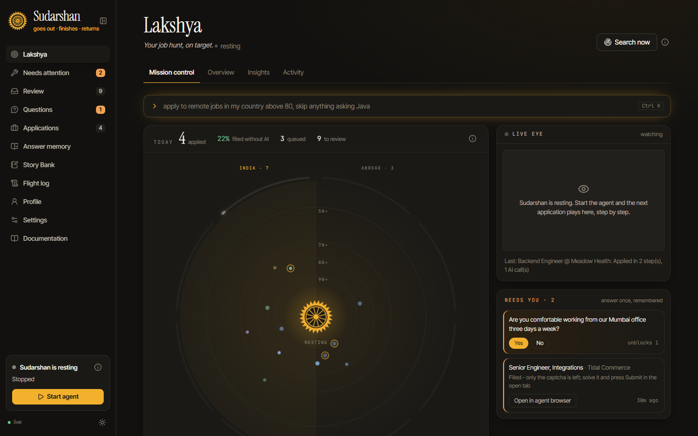
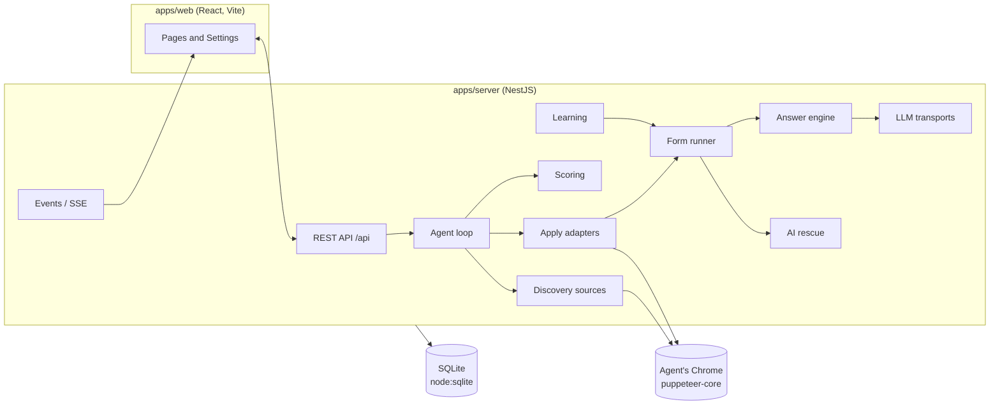

<p align="center">
  
</p>

<h1 align="center">Sudarshan</h1>

<p align="center"><b>Goes out. Finishes the task. Returns.</b><br/>
A local-first job application agent: it searches job sites, scores jobs against your profile, fills and submits the applications you approve, and reports back.<br/>
NestJS + React, SQLite, a real Chrome you can watch. Any AI provider, a local model, or none.</p>

<p align="center">
  <a href="LICENSE"></a>
  
  
  
</p>

<p align="center"></p>

> **Using Sudarshan, not developing it?** Read the **user guide**: open Sudarshan and click **Documentation** in the sidebar, or open [`apps/web/public/docs/index.html`](apps/web/public/docs/index.html). It explains every page and setting with screenshots.
> This README is for people who want to run it from source, fork it, or build on it.

---

## Contents

- [Quick start](#quick-start)
- [How it works](#how-it-works)
- [Tech stack](#tech-stack)
- [Repository layout](#repository-layout)
- [Development](#development)
- [Configuration](#configuration)
- [Data and storage](#data-and-storage)
- [The main flows in code](#the-main-flows-in-code)
- [Extending Sudarshan](#extending-sudarshan)
- [Testing](#testing)
- [Conventions](#conventions)
- [Security model](#security-model)
- [Forking and rebranding](#forking-and-rebranding)
- [Contributing](#contributing)
- [Disclaimer and license](#disclaimer-and-license)

---

## Quick start

You need **Node.js 22.13+** (for the built-in `node:sqlite`) and **Chrome, Edge or Brave**. Nothing else: no database, Docker or Python.

```bash
git clone https://github.com/ankurpandey27/sudarshan-ai.git
cd sudarshan-ai
npm start            # installs, builds if needed, starts on http://localhost:4747
```

`npm start` (`scripts/start.mjs`) installs dependencies, rebuilds only when sources are newer than the build, downloads the answer-matching model once (about 130 MB, into `models/`), starts the server and opens the browser. Exit code 75 from the server means "restart me" (used after restoring a backup), and `start.mjs` relaunches it.

End users can also install with one command; the installers (`install.ps1`, `install.sh`) add Node.js if missing, clone the repo, create a desktop shortcut, and turn on self-update on each start.

---

## How it works



1. **Discover.** Each job site is a `DiscoverySource`. Sources run in parallel and write jobs into the `jobs` table, which is also the queue.
2. **Score.** Exclusions, then a rule-based engine (skills with years, experience, salary, location), then optional batched AI scoring. Jobs go to `review`, `approved` or `skipped`.
3. **Apply.** The agent takes one approved job at a time (paced, within active hours and per-site daily limits). An `ApplyAdapter` reaches the form; the form runner fills it.
4. **Fill.** The page is read in one pass by an in-page extractor; answers come from **profile rules, then answer memory, then one batched AI call, then the user**; everything is filled in one pass and checked again.
5. **Learn.** Answers, per-site steps (recipes), how to operate each kind of field (widget recipes), and four small on-device models are updated from confirmed applications.
6. **Report.** Everything is an event: stored in `activity` and streamed to the UI over Server-Sent Events.

The AI never drives the browser screenshot by screenshot. It answers what rules and memory cannot, picks a button on an unfamiliar page, and rescues a stuck application for a few steps.

---

## Tech stack

| Layer | Choice |
|---|---|
| Server | NestJS 11, TypeScript (strict), `class-validator` DTOs |
| Storage | SQLite through Node's built-in `node:sqlite` (WAL), forward-only migrations |
| Browser | `puppeteer-core` driving the user's own Chrome / Edge / Brave with a persistent profile |
| AI | Anthropic SDK; any OpenAI-compatible API (OpenAI, Gemini, Groq, OpenRouter, Ollama, LM Studio, custom); OpenCode Zen |
| On-device ML | A small multilingual sentence model (`@huggingface/transformers`) for similar questions; tiny learners trained on the user's data |
| Web | React 19, Vite, Tailwind CSS v4, TanStack Query, live updates over SSE |
| Tests | Jest (unit), Jest + real headless Chrome against HTML fixtures (browser) |

---

## Repository layout

```
sudarshan-ai/
├─ apps/
│  ├─ server/                     NestJS app (the agent and the API)
│  │  ├─ src/
│  │  │  ├─ main.ts, app.module.ts, app.setup.ts   bootstrap, security, static web, SPA fallback
│  │  │  ├─ config/               configuration.ts (SUDARSHAN_* environment variables)
│  │  │  ├─ common/               storage (SQLite + migrations), crypto, events, security, logging, utils
│  │  │  └─ modules/              one folder per feature (see below)
│  │  └─ test/                    browser tests + fixtures/ (HTML replicas of real forms)
│  └─ web/                        React app
│     ├─ src/pages/               Lakshya, Review, Questions, Applications, Answers, Stories, Activity, Profile, Settings, Onboarding
│     ├─ src/components/          shared UI (layout, cards, job row, charts…)
│     │  └─ mission/              Lakshya's Mission control: radar, command bar, Live Eye, Needs you, flight recorder
│     ├─ src/lib/                 API client, queries, SSE events, theme, formatting
│     ├─ src/agent-window/        the status page shown in the agent's browser
│     └─ public/docs/             the user guide (static HTML, screenshots, fonts)
├─ scripts/                       start.mjs (the one command), dev.mjs, fetch-model.mjs, test-browser.mjs
├─ install.ps1, install.sh        one-command installers
└─ models/                        the downloaded sentence model (not in Git)
```

### Server modules (`apps/server/src/modules`)

| Module | Responsibility |
|---|---|
| `agent` | The loop: discovery schedule, one-at-a-time applying, pacing, active hours, daily limits; insights for *Needs attention* |
| `discovery` | Job search per site (`sources/*.source.ts`), de-duplication, description enrichment |
| `scoring` | Exclusions, rule-based engine, batched AI scoring, skip reasons |
| `jobs` | The `jobs` table (also the queue), attempts, statuses, platforms, work mode (remote/hybrid/on-site) and region (home/abroad/unknown) |
| `apply` | `ApplyService` orchestration; adapters for LinkedIn, Naukri (chat questions), Indeed and any web form; closed/applied detection |
| `form-engine` | `FormRunnerService` (fill, check, advance), `AnswerEngineService`, profile rules, in-page scripts, recipes, AI rescue |
| `answers` | Answer memory, pending questions, similar-question search |
| `learning` / `learners` | Learning from forms the user finishes; four small self-checking models |
| `llm` | Provider presets, transports, fallback model, daily budget, usage log, capability detection |
| `profile` | Resume PDF to profile, profile check, skill years |
| `browser` | The agent's Chrome, per-site login state, screenshots |
| `settings` | User settings (key-value rows), encrypted keys |
| `stories` | Story Bank for written answers |
| `notifications` / `inbox` | Desktop and Telegram messages, daily summary; reading employer replies over IMAP |
| `backup` | Daily backups, off-machine copy, restore |
| `resumes` | Extra resumes per kind of role |
| `workbook` | Excel import, template, tracker export |
| `analytics`, `taste`, `platform-health`, `applied-sync`, `housekeeping`, `health` | Charts, interest ranking, per-site failure pauses, Indeed "Applied" sync, cleanup, health endpoint |

Each module follows the standard NestJS feature layout: `*.module.ts`, `*.controller.ts`, `*.service.ts`, and `dto/`, `interfaces/`, `enums/`, `constants/`, `utils/`, `scripts/` folders as needed. Unit tests sit next to the code as `*.spec.ts`.

---

## Development

```bash
npm install
npm run dev          # server in watch mode on :4747 + Vite UI with hot reload on :5173
```

| Command | What it does |
|---|---|
| `npm start` | Production-like run: build if needed, start, open the browser |
| `npm run dev` | Server (`nest start --watch`) and Vite together |
| `npm run build` | Build web, then server |
| `npm run typecheck` | `tsc --noEmit` for server and web |
| `npm run lint` | ESLint on the server (`src` and `test`) |
| `npm test` | Unit tests, then browser tests |
| `npm test -w apps/server` | Unit tests only |
| `npm run test:browser -w apps/server` | Browser tests only (needs Chrome or Edge) |

Run a second, throwaway instance next to your real one (useful for live testing without touching your data):

```bash
cd apps/server
SUDARSHAN_DATA_DIR=/tmp/sudarshan-test SUDARSHAN_PORT=4799 SUDARSHAN_OPEN_BROWSER=false \
  node --disable-warning=ExperimentalWarning dist/main.js
```

The UI talks to the API under `/api`. Every write must carry the header `x-jaa-client: 1`, which keeps other websites from driving the local server.

---

## Configuration

Everything a user sets is in the UI and stored in the database. Environment variables are for developers and packagers; each also works with the legacy `JAA_` prefix.

| Variable | Default | Purpose |
|---|---|---|
| `SUDARSHAN_PORT` | `4747` | HTTP port |
| `SUDARSHAN_HOST` | `127.0.0.1` | Bind address (keep it local) |
| `SUDARSHAN_DATA_DIR` | `~/.sudarshan` (or the older `~/.job-apply-agent` when only that exists) | Database, browser profile, uploads, backups, logs |
| `SUDARSHAN_OPEN_BROWSER` | `true` | Open the UI on start |
| `SUDARSHAN_WEB_DIST` | `apps/web/dist` | Where the built UI is served from |
| `SUDARSHAN_MODELS_DIR` | `models/` | Where the sentence model lives |
| `SUDARSHAN_SKIP_MODEL` | unset | `1` never downloads the sentence model |
| `LOG_LEVEL` | `info` | `debug` for more |

Installer-only: `SUDARSHAN_REPO`, `SUDARSHAN_HOME`, `SUDARSHAN_SHORTCUT_DIR`, `SUDARSHAN_NO_START`, `SUDARSHAN_AUTO_UPDATE`.

---

## Data and storage

- **One database file**, `agent.db` in the data folder, opened through `StorageService` (`common/storage`). Tables include `jobs`, `attempts`, `answers`, `pending_questions`, `profile`, `settings`, `activity`, `recipes`, `widget_recipes`, `playbook_steps`, `stories`, `learners`, `llm_usage`.
- **Migrations are forward-only**, an array of SQL strings in `common/storage/constants/migrations.constants.ts`. To change the schema, append a new entry; never edit an old one. The database records its version and runs only what is new.
- **`has_term(text, term)`** is a SQL function `StorageService` registers on every connection: the term as whole words (so "Java" is not in "JavaScript"). The jobs list's `exclude` filter uses it.
- **Settings** are key-value rows (`llm`, `search`, `sources`, `agent`, …) holding JSON, validated by the DTOs in `modules/settings/dto`.
- **Secrets** (AI keys, Telegram token, mailbox password) are encrypted with AES-256-GCM by `SecretBoxService`, using `secret.key` generated on first run. Backups never include it.
- **The agent's browser profile** lives in `browser-profile/` inside the data folder, so logins persist and the user's own Chrome profile is never touched.

---

## The main flows in code

| Flow | Start reading at |
|---|---|
| The agent loop | `modules/agent/agent.service.ts` → `tick()` |
| Searching | `modules/discovery/discovery.service.ts` → `runSource()`; sites in `modules/discovery/sources/` |
| Scoring | `modules/scoring/` |
| Where and how a job is worked | `modules/jobs/utils/job-place.util.ts` (`workModeOf`, `regionOf`, places learned from listings); `JobsService.classifyPlaces`, run by `ScoringService` before each scoring run, at start-up and when the profile changes |
| Queue order | `queueOrder()` in `modules/jobs/jobs.service.ts`: used by `nextToApply` and the Approved tab (`sort=queue`), with jobs in your country first when `agent.homeFirst` is on |
| Applying | `modules/apply/apply.service.ts` → `applyTo()`; reaching the form in `modules/apply/adapters/*.adapter.ts` (`prepare()`) |
| Filling a form | `modules/form-engine/form-runner.service.ts` → `run()`, `fillAndCheck()`, `chooseAction()` |
| Reading a page | `modules/form-engine/scripts/extract-form.script.ts` (runs inside the page) |
| Answering | `modules/form-engine/answer-engine.service.ts` → `resolve()`; rules in `utils/profile-rules.util.ts`; prompt in `utils/answer-prompt.util.ts` |
| AI rescue | `modules/form-engine/rescue.service.ts` |
| Learning from the user | `modules/learning/learning.service.ts` and `scripts/recorder.script.ts` |
| Live updates | `common/events` → `GET /api/events/stream` (SSE) → `apps/web/src/lib/events.tsx` |
| Mission control (Lakshya's first view) | `apps/web/src/components/mission/mission-control.tsx`. The radar (`radar.tsx`) places jobs from `GET /api/jobs?status=review,approved,applying` (ring = score, half = `region`) and animates the SVG directly in one `requestAnimationFrame` loop; comets start on `apply.step` "Applying:" events and land on `job.updated`. Live Eye polls `GET /api/agent/live` and shows `GET /api/agent/live/shots/:attemptId/:index` (`ApplyService.live()`, only pictures of the attempt in progress). The command bar's sentence parser is `apps/web/src/lib/command.ts` - rules, no AI - and maps to the jobs filters (`workMode`, `region`, `minScore`, `platform`, `withinDays`, `exclude`) and `POST /api/jobs/approve-strong`. The flight recorder reads `GET /api/events/history?day=…`. |

Functions named `…InPage` run inside the browser through `page.evaluate`, so they must be self-contained: no imports or outside variables.

---

## Extending Sudarshan

### Add a job site (search)

1. Add the platform to `modules/jobs/enums/job-platform.enum.ts`, and map it in `modules/jobs/constants/job-platform.constants.ts`, `utils/platform.util.ts` (host → platform) and `utils/source-label.util.ts`.
2. Write `modules/discovery/sources/<site>.source.ts` implementing `DiscoverySource` (`search`, optionally `enrich` and `combine`), and register it in the discovery module.
3. If the site lists one country's jobs only, add it to `SITE_COUNTRY` in `modules/jobs/constants/countries.constants.ts` so its bare "Remote" jobs get a region.
4. Add its on/off switch and daily limit to the sources settings (`modules/settings`) and the safe-pace table.
5. If it needs a login, add it to `SITES` in `modules/browser/constants/sites.constants.ts` (login URL and auth cookies; leave cookies empty and Sudarshan learns them the first time the user logs in), and to `apply/constants/site-of-platform.constants.ts`.
6. On the web side, add its label and colour (`apps/web/src/lib/format.ts`, `--p-<site>` in `tokens.css`), its safe pace (`lib/safe-pace.ts`) and its one-line description in `ABOUT` (`components/apply-on-card.tsx`).

### Add an apply path

Most sites need nothing: `WebApplyAdapter` follows Apply buttons, handles cookie banners, bot checks, profile walls and embedded hiring systems, then the generic form runner fills the form. Write an `ApplyAdapter` only for a site with its own flow (like Naukri's chat): implement `matches`, `prepare` and, if needed, `runForm`, and add it to `ApplyService`.

### Add an AI provider

Add the kind to `modules/llm/enums/llm-provider-kind.enum.ts` and a preset (base URL, key hint, default model) to `modules/llm/constants/llm-presets.constants.ts`. OpenAI-compatible providers need nothing else; others need a transport in `modules/llm/transports`. Never hard-code which models can do what: capabilities (images, prompt size) are found by trying and remembered per model.

### Teach it a new kind of question

Add a rule to `modules/form-engine/utils/profile-rules.util.ts` (a `test` regex on the question, an `answer` from the profile, and a `key`). High-stakes topics belong in `constants/inference.constants.ts` so the AI never guesses them.

### Change the schema or settings

Append a migration (see [Data and storage](#data-and-storage)). For a new setting, add it to the DTO in `modules/settings/dto`, its default in `modules/settings/constants/default-settings.constants.ts`, and the field in `apps/web/src/pages/settings.tsx`.

---

## Testing

```bash
npm test -w apps/server                 # ~570 unit tests
npm run test:browser -w apps/server     # ~65 tests in a real headless Chrome
```

- **Unit tests** cover rules, scoring, answering, detection patterns and services, with in-memory SQLite (`new StorageService(':memory:')`) and a fake LLM.
- **Browser tests** load HTML fixtures from `apps/server/test/fixtures/`: small replicas of real forms (LinkedIn's redraws, Greenhouse dropdowns, Ashby's yes/no buttons, Hirist screening, a job page with an ad over Apply…). When a real site breaks something, the fix comes with a fixture that reproduces it.
- **Live testing** is still the final check: job sites change often. Use a throwaway data folder and port (see [Development](#development)), keep *Stop before the final Submit* on, and watch the Flight log.

Before a pull request: `npm test`, `npm run typecheck` and `npm run lint` must pass.

---

## Conventions

- **Feature modules** in the NestJS layout above; code goes in the module it belongs to, shared code in `common/`.
- **Comments say why**, often with the real case that caused them (site and date), so a later change does not undo a fix by accident.
- **Work with any AI model.** No lists of which models can do what; detect and remember.
- **Never solve or bypass captchas, never create accounts, never type passwords.** Hand over to the user and carry on after.
- **Never guess personal or high-stakes facts.** Ask the user once; remember the answer.
- **Personal data never reaches the AI** (identifiers are masked) and **never goes in the repository** (logs, fixtures and screenshots use made-up data).
- Commit messages describe the behaviour change and the case behind it.

---

## Security model

- The server binds to `127.0.0.1`, sends a strict Content-Security-Policy (no inline scripts), and refuses writes without the `x-jaa-client` header, so other websites cannot use it.
- Secrets are encrypted at rest and never returned to the UI (only a hint such as `sk-...3456`).
- Text from job posts, pages and form questions is fenced as untrusted data in every prompt; posts that address AI tools are scored by rules only.
- Submits are recorded the moment they are pressed, so a crash never sends an application twice.

---

## Forking and rebranding

- The product name, colours and fonts live in `apps/web/src/tokens.css`, `styles.css` and the logo files in `apps/web/public/`. The user guide (`apps/web/public/docs/`) uses the same tokens.
- The data folder name and environment prefix are in `apps/server/src/config/configuration.ts`.
- The default port is `4747`; the installers point at this repository through `SUDARSHAN_REPO`.
- The guide's screenshots are taken from a demo data folder with a made-up candidate. Retake them after UI changes rather than using your own data.
- MIT licensed: keep the copyright notice and license file in your fork.

---

## Contributing

Issues and pull requests are welcome. Job sites change their pages often, so the most useful bug report includes:

1. What you expected and what happened.
2. The **Flight log** lines around the problem.
3. For a failed application: the step trace from **Applications → the job → Attempts**.

Remove personal details (name, email, phone, salary) before posting. For a site-specific fix, add an HTML fixture that reproduces the page and a browser test.

---

## Disclaimer and license

Sudarshan automates actions in the user's own browser, on their own accounts. Automated applying may break a job site's terms of service, and sites can restrict accounts that apply too fast. The defaults are conservative, but users are responsible for how they use it. It is not affiliated with LinkedIn, Naukri, Indeed or any AI provider.

Created by **[Ankur Pandey](https://github.com/ankurpandey27)**. MIT; see [LICENSE](LICENSE).
